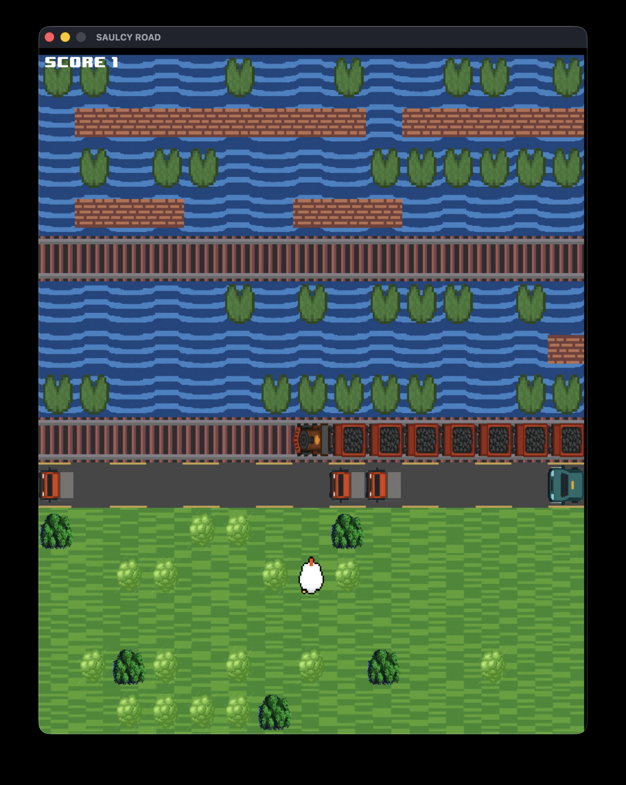

# Saulcy Road

> **Note on the project**
> This project was carried out as a group university project. Therefore, I did not complete all the work presented here.
>
> My main contributions to this project were:
> *   Contribution to the design of the data representation.
> *   Realization of a state of the art and study of the functioning of Crossy Road.
> *   Project management: planning on Asana, writing the project sheet and meeting reports.
> *   Development of the "locker room" feature and the main menu.
> *   Creation of sprites.

## About the project

Saulcy Road is a game developed in C, inspired by the famous game "Crossy Road". The objective is to guide a character through a game board filled with obstacles, trying to get as far as possible. Each step forward increases the score, and the best score is saved.



## Features

### Game Modes

The game offers several modes:

-   **Text Version**: A simplified version that is played directly in the terminal. The player controls the character with the WASD keys or the arrows.
-   **Graphical Version**: A more immersive 2D version with a graphical interface made using the SDL2 library.
-   **AI Mode**: In both versions, it is possible to let an artificial intelligence play for you and try to get the best score.

### Characters and Obstacles

-   **Locker Room**: A menu allows you to choose the character's appearance from several options: Chicken, Duck or Crocodile.
-   **Game Board**: The board is randomly generated for each game and is composed of different types of strips: road, river, meadow and train tracks.
-   **Obstacles**:
    -   **Lethal**: Cars, trucks, trains and water.
    -   **Slowdowns**: Bushes and trees that hinder progress.

## Technical Explanations

### Language and Libraries

-   **Language**: The project is entirely developed in **C**.
-   **Libraries**:
    -   `SDL2`, `SDL2_image`, `SDL2_mixer`: For the graphical version, management of sprites, animations and audio.
    -   `ncurses`: For display management in the text version.
    -   `CUnit`: For unit tests.

### Code Structure

The code is organized in a modular way for better clarity and maintenance:

-   `partie.c`: Contains the core of the game logic (movement, collisions, score).
-   `renderer.c`: Manages the display of the graphical version (window, textures, menus).
-   **Data Structures**: The game uses linked lists to represent the different elements of the board (lines, static and dynamic obstacles).
-   **AI**: An algorithm has been implemented to allow a virtual player to find the safest path.

## How to run the project

### Prerequisites

Make sure you have the following libraries installed on your system:
-   `SDL2`
-   `SDL2_image`
-   `SDL2_mixer`
-   `CUnit`
-   `ncurses`

On macOS, you can install them with Homebrew:
```bash
brew install sdl2 sdl2_image sdl2_mixer cunit
```
On Debian-based distributions (like Ubuntu):
```bash
sudo apt-get install libsdl2-dev libsdl2-image-dev libsdl2-mixer-dev libcunit1-dev
```

### Compilation and Execution

A `Makefile` is provided to simplify the compilation and execution of the project.

1.  **Compile the game**:
    ```bash
    make build
    ```

2.  **Launch the game**:
    ```bash
    make run
    ```
    or
    ```bash
    ./app
    ```

3.  **Compile and run the unit tests**:
    ```bash
    make test
    ```

4.  **Clean up the compilation files**:
    ```bash
    make clean
    ```
